<h1 align="center">Hi, I'm Hatimou 👋 — Full Stack Developer</h1>

  <b>TypeScript · Go · PHP · Java &nbsp;|&nbsp; APIs · Microservices · Clean Architecture</b>

  <i>"Code is Art — Craft it like it matters, because it does."</i>

---

## 👨‍💻 About me

- 💻 **Full Stack Developer** — TypeScript, Go, PHP (Laravel), Java (Spring Boot), React, Next.js, Angular
- 🔥 **Spécialités** : APIs REST haute performance, architectures modulaires & microservices, systèmes back-end robustes
- ❤️ **Passions** : Software craftsmanship, open source, Clean Architecture, Domain-Driven Design
- 🎓 Ingénierie Informatique — [IpNet Institute of Technology](https://ipnet-togo.com) | Licence Biologie — [Université de Lomé](https://paul.univ-lome.tg) (Togo)
- 🌍 Basé au Togo 🇹🇬 — **Ouvert aux opportunités internationales & remote**
- 🚀 **Vision** : Rejoindre des équipes d'excellence pour construire des produits à grande échelle et avoir un impact réel
- ⚡ **Philosophie** : Clean code, pragmatisme et *progress over perfection - La perfection est une destination, pas le chemin*

---

## 🛠️ Tech Stack

**Languages** 
`TypeScript` `JavaScript` `Go` `Java` `PHP` `Python` `HTML/CSS`

**Backend**
`Spring Boot` `NestJS` `Node.js` `Laravel` `Django` `Flask` `Gin (Go)`

**Frontend**
`React` `Next.js` `Angular`

**Databases & Infra**
`PostgreSQL` `MySQL` `MongoDB` `Redis` `Docker` `Kubernetes` `AWS/GCP` `CI/CD` `REST APIs`

**Practices & Patterns**
`Clean Architecture` `DDD` `Microservices` `TDD` `Git/GitHub` `Agile`

---

## 📈 Currently leveling up

- ☁️ **Cloud & Infrastructure** — AWS / GCP, serverless, conteneurisation Docker/K8s
- 🏗️ **System Design** — architecture distribuée, scalabilité, patterns à haute disponibilité
- 🔐 **Sécurité applicative** — OWASP, OAuth2, authentification avancée
- 🧠 **AI/LLM Integration** — intégration d'IA dans des applications métier réelles
- 📐 **DDD & Clean Architecture** — approfondissement sur des codebases complexes
- 🐦 **Go avancé** — performance, concurrence, APIs à très faible latence

---

## 🎯 Looking to collaborate on

- 🔧 **Back-end challenging** — Spring Boot, NestJS, Go, Laravel, microservices avec haute disponibilité
- 🌐 **Full Stack** — React/Next/Angular + API robuste, expérience utilisateur soignée
- 👥 **Open Source** — projets à impact, bien structurés, avec une vraie communauté
- 🌱 **Startups ou scale-ups** cherchant un développeur investé, fiable, à la fois autonome et équipier solide
- 🤝 **Toute équipe ambitieuse** où la qualité du code et l'architecture comptent autant que la vélocité

---

## 🏆 Featured Projects

> La plupart de mes projets sont en dépôts privés — voici quelques réalisations clés :

| Projet | Description | Stack |
|--------|-------------|-------|
| **EduShare** | Plateforme de partage de ressources pédagogiques entre étudiants et enseignants | Next.js · NestJS · PostgreSQL |
| **JMS** | Application web complète de gestion de garage (stocks, interventions, clients, facturation) | React · Go (Gin) · PostgreSQL |
| **C2E Bulletin** | App web de gestion de bulletins pour automatiser les processus internes de C2E *(en cours)* | Angular · NestJS · PostgreSQL · TypeScript |

> 📬 Vous travaillez sur un projet ambitieux ? [Contactez-moi !](mailto:devfreelancer001@gmail.com)

---

## 📧 Me contacter

  
  
  

---

## 📊 Un peu de stats

  

  

---

## ⚠️ À savoir

La plupart de mes projets sont privés, mais n'hésite pas à me contacter si tu veux discuter ou collaborer sur quelque chose. Les repos publics que tu vois ici sont mes projets open source en quelque sorte !

---

  <b>Merci de visiter mon profil ! If you like what I do, don't hesitate to reach out ! 🚀</b>

<!---
OLD
--->

<!-- - 👋 Hi, I’m Hatimou going by @DevAventurier / Ash for friends
- 👀 I’m mostly interested in mastering coding skills
- 🌱 Currently learning Computer Enginering at IpNet Institute of Technology in Lome-Togo
- 💞️ Looking to collaborate on JAVA/Springboot/Angular/React, Php/Laravel, Python/Django/Flask and JS projects
- 📫 How to reach me ?: devfreelancer001@gmail.com
- ⚡ NINDO: Code is Art
- PS : Sign me for appropriate overview, cause most of my repo are private -->

<!---
Hatimou-Nabina/Hatimou-Nabina is a ✨ special ✨ repository because its `README.md` (this file) appears on your GitHub profile.
You can click the Preview link to take a look at your changes.
--->

<!--
**Hatimou-Nabina/Hatimou-Nabina** is a ✨ _special_ ✨ repository because its `README.md` (this file) appears on your GitHub profile.

Here are some ideas to get you started:

- 🔭 I’m currently working on ...
- 🌱 I’m currently learning ...
- 👯 I’m looking to collaborate on ...
- 🤔 I’m looking for help with ...
- 💬 Ask me about ...
- 📫 How to reach me: ...
- 😄 Pronouns: ...
- ⚡ Fun fact: ...
-->
